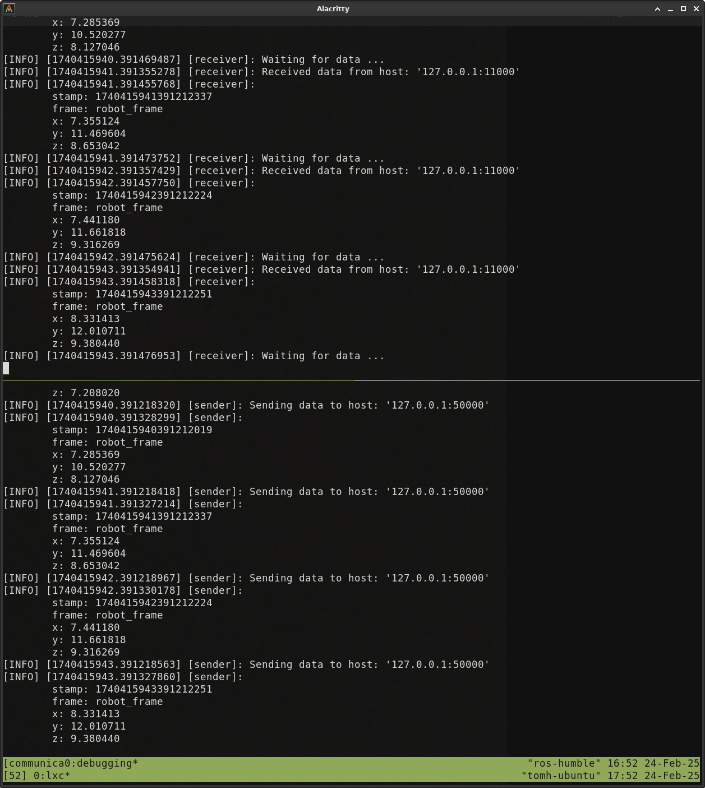

# Laboratorní úloha číslo 2 - Nasazení a udržování robotu v systému Linux

## Cíl cvičení 
Výledkem cvičení je:
1. Funkční spustitelné skripty pro kompilaci a spouštění programů.
2. Funkční posílání požadované zprávy mezi programy odesílatel a příjemce.



## Domácí příprava

### Předpoklady

* Vytvoření vlastního účtu na [GitHub.com](https://github.com/) a seznámení se s základními příkazy a koncepty nástroje `git` (forky, pushování, pullování, větve, ssh klíče).
* Základní linuxové příkazy a navigace v terminálu (otevírání a vytváření souborů, úprava souborů, změna adresářů, přesouvání souborů atd.)
* Pochopení základního posílání a přijímání dat přes jednoduché UDP sockety v Linuxu.
* Pochopení základních konceptů formátů konfigurací (json, yaml, toml atd.) a odesílání serializovaných bajtových streamů přes sockety.
* Základní znalosti C++.

> [!IMPORTANT]  
> Zadání není nijak náročné, ale potřebuje pochopení principů práce s gitem, ovládání příkazů v linuxovém terminálu, a základy C++, které jsou všechny prerekvizity pro úspěšné pokračování a dokončení kurzu. Důrazně doporučuji si všechno nastudovat doma. Pokud můžete, klidně si cvičení udělejte doma celé. 

## Hodnocení cvičení

> [!CAUTION]
> Na konci cvičení bude práce ohodnocena až **5 body**!

> [!CAUTION]  
> Při každém pushnutí do repozitáře se zároveň spustí automatizované ověřování funkčnosti (viz. sekce `Actions` na webové stránce repozitáře). Po vytvoření forku se tyto akce musí v sekci `Actions` dodatečně povolit. Můžete si je prohlédnout v souboru `.github/workflows/test.yml` a také v `tests/solutionTest.cpp`, je zakázáno tyto soubory modifikovat. **Na konci tohoto cvičení musí všechny testy procházet bez chyb!**

> [!IMPORTANT]  
> Cvičení nebude hodnoceno jen na základě funkčnosti. Bude hodnoceno i pochopení problematiky a schopnost příkazy spouštět na poptání. Doporučuji se připravit na otázky z domácí přípravy.

## Úkoly

Úkoly není potřebné dělat v přesném pořadí, ale je to silně doporučeno.

### Git

Všechna vaše práce v tomto kurzu bude uložena a zálohovana přes repozitář na GitHubu. Vytvoříte si vlastní `fork` projektu, kde budete uchovávat veškerou svou práci a přistupovat k ní z jakéhokoli počítače. Měli byste být obeznámeni se základními příkazy pro `git` a pracovním postupem. Pokud ne, měli byste si udělat některé tutoriály, jako je například [tento](https://learn.microsoft.com/en-us/training/modules/intro-to-git/). Aby počítač mohl přistupovat a provádět změny ve vašem repozitáři na GitHubu, měl by mít SSH klíč spojený s vaším účtem na GitHubu.

Pro toto zadání budete pracovat z větve `linux-intro`.

> [!CAUTION]  
> Všechny změny si průběžně pushujte do repozitáře. Jakékoliv změny, které nejsou uloženy ve vašem git repozitáři, mohou být navždy ztraceny!

1. Udělejte si fork repozitáře [mpc-rbt-student](https://github.com/Robotics-BUT/mpc-rbt-student) do svého účtu na GitHubu.
> [!WARNING]
> Pokud necháte zaškrtnutou možnost "Copy the `main` branch only", naklonuje se vám pouze větev `main`. Zbýlé větve se pak musí do forku přidat podle [těchto pokynů](https://gist.github.com/asanchezr/fd8f0fec142ff053c9d5332598a86a2b).

> [!NOTE]
> Pokud by váš fork zaostával za upstreamem, nezapomeňte jej synchronizovat z webové stránky GitHubu (`Sync fork` a `Update branch`).
2. Postupujte podle [oficiálních pokynů](https://docs.github.com/en/authentication/connecting-to-github-with-ssh/adding-a-new-ssh-key-to-your-github-account) k propojení SSH klíče umístěného v `~/.ssh/` s vaším účtem na GitHubu.
> [!NOTE]  
> Pokud pracujete na svém vlastním osobním počítači, měli byste také postupovat podle [těchto](https://docs.github.com/en/authentication/connecting-to-github-with-ssh/generating-a-new-ssh-key-and-adding-it-to-the-ssh-agent#generating-a-new-ssh-key) pokynů pro vytvoření nového SSH klíče.
3. Vytvořte si pracovní složku (`workspace`), naklonujte do ní svůj fork repozitáře a udělejte checkout na větev `linux-intro`.

### Shell

Ne vždy budete mít přístup k pěknému grafickému uživatelskému rozhraní a měli byste být obeznámeni s prací v terminálu (nebo terminálovém emulátoru). V systému jde pomocí terminálu ovládat vše. Aby jste si usnadnili život, můžete vytvářet `shell` skripty, které vykonávají více příkazů a dokonce i složitější logiku místo psaní všech příkazů po jednom ručně. Pro tento úkol byste měli znát základy kompilace `cmake` balíčků, pokud ne, postupujte podle krátkého úvodu, jako je třeba [tento](https://hsf-training.github.io/hsf-training-cmake-webpage/02-building/index.html). Měli byste také vědět, jak vytvářet a spouštět jednoduché `shell` skripty. Pokud potřebujete pomoc, projděte si [tento návod](https://help.ubuntu.com/community/Beginners/BashScripting).

1. Zkuste skompilovat naklonovaný projekt.
2. Vytvoří to dvě spustitelné binární soubory: `sender_node` a `receiver_node`. Zkuste je spustit.  
    > Proč selžou?
3. Najděte konfigurační soubor `config.json` a zkuste je znovu spustit s tímto souborem jako argument.
    > Stále to selže, proč?
4. Vytvořte shell skript s názvem `build.sh`, který provede všechny kroky kompilace.
5. Vytvořte dva další skripty `run_sender.sh` a `run_receiver.sh`, které spustí zkompilované binární soubory.  
> [!WARNING]
> Nezapomeňte, že všechny cesty jsou vždy relativní k vašemu aktuálnímu `pwd`.
6. Ověřte, že všechny tři skripty fungují správně (selhání samotných programu vyřešíte později).
> [!TIP]
> Nezapomeňte skriptům nastavit správné práva pomocí příkazu `chmod`.

### Shell Prostředí

Shell může mít také definovány nějaké proměnné prostředí (environment variables). Jakýkoli program, který spustíte v shellu, může během svého provádění použít tyto proměnné (také nazývané jednoduše "prostředí"). Obvykle budou obsahovat cesty k jiným binárním souborům nebo knihovnám, verze programů nebo jiné direktivy, které mohou ovlivnit chování programu. V tomto cvičení budete používat vlastní proměnnou `LOG_LEVEL`, která modifikuje výstup logů programů `sender_node` a `receiver_node`.

Proměnnou můžete zadat inline s příkazem (`VAR=<nějaká-hodnota> <nějaký-příkaz>`). Bude použita pouze jednou a viditelná pouze pro program, který je spuštěn s ní. Nebo můžete proměnnou exportovat do prostředí (např. `export VAR=<nějaká-hodnota>`). Bude viditelná pro všechny programy, které spustíte v tomto shellu, dokud jej neopustíte. Pokud chcete, aby byla proměnná trvalá, musí být umístěna v nějakém skriptu, který je automaticky vykonán v určitý čas (při přihlášení, při zapnutí, atd.).

1. Použijte příkaz `printenv` k zobrazení všech proměnných prostředí, které jsou nastaveny ve vašem aktuálním shellu.
2. Použijte proměnnou `LOG_LEVEL` inline s vašimi zkompilovanými programy k ovládání toho, jaký výstup logu bude zobrazen při běhu.  
> [!TIP]
> Používejte čísla mezi 0 a 6 pro nastavení různých úrovní. Mění se něco?
3. Exportujte proměnnou `LOG_LEVEL` a zkontrolujte, že je správně nastavena ve vašem aktuálním shellu.
4. Podívejte se na obsah skriptu `.bashrc` pomocí `cat ~/.bashrc`.  
> [!NOTE]
> Toto je skript, který se používá k automatické přípravě prostředí shellu pokaždé, když se přihlásíte nebo otevřete nový terminál. Můžete zde přidávat nové proměnné, funkce nebo skripty, které budou spuštěny pokaždé, když se otevřete nový terminál.

### Multiplexování Terminálů

Často budete muset spustit více programů v samostatných terminálových oknech. Pro zjednodušení můžete použít terminálové multiplexory místo manuálního otevírání oken. Přečtěte si [tento README](https://github.com/tmuxinator/tmuxinator?tab=readme-ov-file#tmuxinator) pro jeden z multiplexorů nazvaný `tmuxinator`.

1. Použijte příkaz `tmuxinator start -p debug_session.yml` k spuštění nové terminálové relace s uvedenou konfigurací.
2. Otevřete konfigurační soubor `debug_session.yml` a nahraďte všechny příkazy `echo` skripty, které jste vytvořili pro kompilaci a spuštění v předchozím úkolu.
> [!TIP]
> Proměnnou `LOG_LEVEL` můžete také exportovat v sekci `pre_window:`.

> [!NOTE]
> Všimněte si příkazu `source /opt/ros/humble/setup.bash`, který je již předdefinován - tento exportuje všechny proměnné potřebné pro ROS 2 (cesty ke knihovnám, binárkám, atd.) podobně jako naše vlastní `LOG_LEVEL`. V tomto cvičení ROS 2 ještě nepoužíváme, ale již se spoléháme na některé funkce, takže musí být v prostředí. Toto bude velmi důležité v dalších cvičeních s ROS 2. Tento příkaz byl také přítomen ve skriptu `.bashrc`, takže prostředí ROS 2 bylo vždy automaticky připraveno v našem shellu a nikdy jsme jej nemuseli používat.
3.  Spusťte relaci znovu. Měli byste nyní vidět, že oba programy se spustí v samostatných oknech.
    > **Ale stále selhávají!**

### Kód

Budete muset dokončit některé části kódu, aby fungovaly správně. Nyní byste měli mít všechny nástroje pro postupné opravení všech problémů. Tyto programy implementují některé velmi základní funkce pro předávání zpráv. ROS 2 zde nepoužíváme, takže si vše musíme implementovat sami.

* Odesílatel pravidelně vykonává callback. Callback připraví data zprávy, serializuje je a odešle je přes socket.
* Příjemce přijímá novou zprávu na socketu a poté vykonává callback. Callback deserializuje zprávu a provádí s ní nějakou operaci.
* Oba programy používají unixový UDP socket pro komunikaci. Podívejte se na definici socketu v `Socket.hpp`. Toto nebudete upravovat, ale budete muset metody správně používat.
* Podívejte se na struktury konfigurace a zprávy v `Utils.hpp`. Toto je konfigurace, která je načítána ze souboru `config.json`, a zpráva, která bude posílána mezi odesílatelem a příjemcem. Toto nebudete upravovat, ale budete muset metody správně používat. Některé metody nejsou dokončeny, dokončíte je v `Utils.cpp`.

1. Otevřete soubory `Receiver.hpp` a `Sender.hpp` a dokončete konstruktory. Musí provést dvě věci:  
    1. Připravit UDP socket (vytvořit, nakonfigurovat a připojit).  
    2. Inicializovat funkci `callback`.
> [!TIP]
> Zde jsou některé příklady, jak nastavit funkce callback:  
> ```  
> callback = [this] { function(); };  
> callback = std::bind(&function, this, std::placeholders::_1);  
> ```  
> Zjistěte, jak je použít. Projděte si nějakou dokumentaci, pokud je třeba. Jaká funkce by měla být použita místo `function`?
2. Znovu skompilujte a spusťte.
     > Stále selhává, proč?

> [!TIP]
> Využívejte multiplexování a skripty, které jste si vytvořili v předchozích úkolech.

> [!WARNING]
> Pokud jste správně implementovali konstruktory, měli byste mít další chybu UNIMPLEMENTED. Pokud vidíte jiné chyby, je vaše řešení špatné.
3. Otevřete soubory `Receiver.cpp` a `Sender.cpp` a dokončete callback funkce.  
    * Callback odesílatele by měl:  
      1. Vyplnit všechny hodnoty (`x`, `y`, `z` se musí měnit - inkrementujte je nebo je vyplňujte náhodnými čísly, je to na vás).
      2. Serializovat data do rámce pro odeslání.
      3. Odeslat rámec a zaznamenat odeslané hodnoty do logu.
    * Callback příjemce by měl:  
      1. Deserializovat přijatý rámec do dat a zaznamenat přijaté hodnoty do logu.  
> [!TIP]
> Použijte předem implementovaný `timestamp`, abyste si pomohli.  

> [!NOTE]
> Všimněte si, že přijímání rámce již probíhá v metodě `run()`, takže to dělat nemusíte.
4. Znovu skompilujte a spusťte.
    > Spustí se, ale nefunguje správně, proč?

> [!TIP]
> Použijte proměnnou `LOG_LEVEL`, abyste zjistili, zda jsou na výstupu nějaké zprávy logu.
5. Otevřete soubor `Utils.cpp` a zkontrolujte první nedokončenou metodu. Tato by měla převést data `json` ze souboru `config.json` na strukturu `Config::Sender`.
> [!TIP]
> Podívejte se na soubor `config.json` a strukturu `Config::Sender`. Co chybí? Použijte předem implementovaný `localPort` k tomu, abyste si pomohli.
6. Otevřete soubor `config.json` a nastavte nějaké rozumné parametry pro odesílatele a příjemce.  
    > Použijte localhost adresu.

    > Jaké hodnoty by měly mít porty?
7. Znovu skompilujte a spusťte.
    > Komunikují, ale zprávy nefungují, proč?
8. Otevřete soubor `Utils.cpp` a zkontrolujte poslední nedokončené metody. Ty by měly převést strukturu `Message` na data `json`, a naopak převést data `json` na strukturu `Message`.
> [!TIP]
> Podívejte se na strukturu `Message`. Co chybí? Použijte předem implementovaný `timestamp` k tomu, abyste si pomohli.
9.  Znovu skompilujte a spusťte.
> [!WARNING]
> Pokud jste vše správně implementovali, měli byste vidět všechna data přenesená od odesílatele k příjemci. Pokud data nevidíte, vaše řešení je špatné.

### Služby Systému

Běžnou metodou pro automatické úkoly v Linuxovém systému je správce `systemd`. Ten vykonává úkoly (nazývané služby (services)) v různých bodech během běhu operačního systému (úkoly po spuštění, při vypnutí, po připojení k síti, atd.). Každá služba má více možností konfigurace. Můžete definovat své vlastní služby, které spustí všechny vaše programy, když se váš robot zapne, místo toho, abyste je spouštěli ručně. Všechny vlastní konfigurační soubory služeb jsou obvykle umístěny v adresáři `/etc/systemd/system/`. Prostudujte si [tuto dokumentaci](https://wiki.archlinux.org/title/Systemd) abyste se dozvědeli více o `systemd` a jeho základním použití.

V tomto cvičení nebudete přidávat žádné soubory do složky `/etc/systemd/system/`. Budete pouze upravovat konfigurační soubory umístěné zde. Pro zajištění této funkce spusťte skript `prepare_service_file_links.sh`. Nyní postupujte podle kroků:

1. Otevřete konfigurační soubory `example_receiver.service` a `example_sender.service` a doplňte chybějící nastavení (`User`, `WorkingDirectory`, `ExecStart`).
> [!TIP]
> Využijte spouštěcí skripty, které jste si vytvořili v předchozích úkolech.

> [!WARNING]
> Všechny cesty zde musí být absolutní plné cesty.

>[!WARNING]
> Nezapomeňte, že pokaždé, když provedete změny v konfiguračním souboru služby, musíte znovu načíst daemon: `sudo systemctl daemon-reload`.
2. Spusťte službu pomocí `sudo systemctl start <název-služby>` a ověřte, že služba spustí program správně pomocí `systemctl status <název-služby>`.
3. Zobrazte si kompletní historii logu příkazem `journalctl -u <název-služby>`.
    > Proč služba selhává?

> [!IMPORTANT]
> Programy spouštěné přes správce `systemd` nemají standardně nastavené žádné prostředí. To se musí nakonfigurovat buďto přidáváním nastavení `Environment="VAR=<nějaká-hodnota>"` do konfigurace služby, nebo přímo ve skriptu, který služba spouští.
4. Do skriptů `run_receiver.sh` a `run_sender.sh` přidejte nastavení prostředí, které jsme již viděli v předchozích úkolech: `source /opt/ros/humble/setup.bash`.
> [!TIP]
> Můžete také přidat exportování proměnné `LOG_LEVEL`.
5. Sledujte stav pravidelně pomocí příkazu `watch "systemctl status <název-služby>"`.
> [!NOTE]
> Použijte nápovědu k tomu, jak změnit interval aktualizace pro příkaz `watch`.
6. Otevřete konfigurační soubor `service_session.yml` a nahraďte zprávy `echo` sledováním obou služeb.
7. Spusťte relaci pomocí `tmuxinator start -p service_session.yml`.

## Závěr

V tomto cvičení jste experimentovali se základními příkazy shellu a skriptováním, a některými nástroji pro ladění a nasazování programů na robotu. Naučili jste se, jak lze navázat komunikační spojení mezi dvěma programy bez použití nástrojú, jako je ROS 2. Naše malé řešení není příliš robustní a není škálovatelné. Zamyslete se nad:
* implementací více různých zpráv, které by měly být předávány mezi mnoha programy nebo uzly (nodes) (nejen mezi dvěma jednoduchými),
* zajištěním, že všechny zprávy dorazí ve správném pořadí na správný uzel a neztratí se,
* implementací více callbacků, které vykonávají různé úkoly v závislosti na typu zprávy (nejen jeden),
* schopností rychle rekonfigurovat a měnit jakoukoli z těchto věcí.

To je důvod, proč budete používat nástroj ROS 2, který tyto věci výrazně usnadní a umožní vám řešit abstraktnější úkoly v robotice, jako je lokalizace nebo navigace robota.
