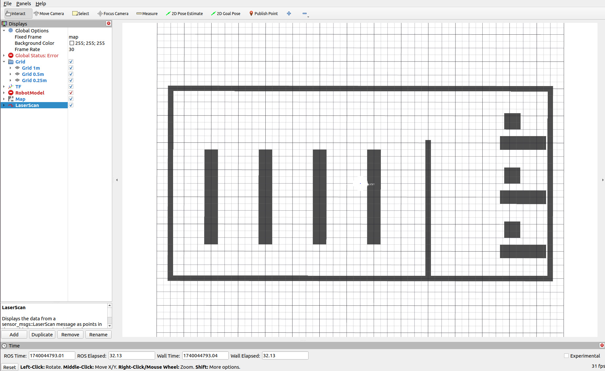
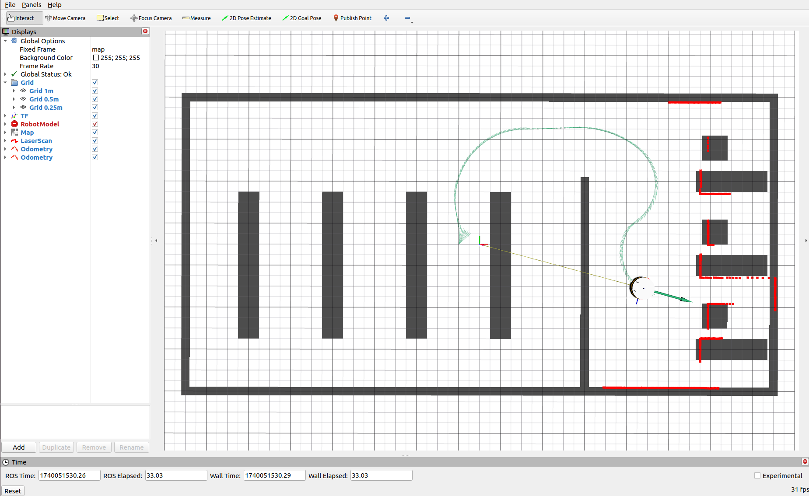

# Laboratorní úloha číslo 5 - Implementace přímé kinematiky
Cílem tohoto cvičení je implementovat přímou kinematiku diferenciálně řízeného robota na základě údajů z enkodérů. Studenti se naučí, jak vypočítat odometrii, která bude publikována jako ROS 2 topik. Součástí cvičení je i publikování transformací mezi souřadnicovými systémy robota a vizualizace odometrie v RViz2. Kromě toho se studenti budou zabývat tím, jak pracovat s různými zprávami a formáty dat v ROS 2, včetně použití správných zpráv pro publikaci přímé kinematiky a transformací. Studenti v rámci příprav na cvičení pochopí výynam jednotlivých druhů framů (souřadnicových systémů) a jaký mají praktický výynam v mobilní robotice. 

## Cíl cvičení 
Výledkem cvičení je:
  1) Publikace topiku /odometry s příslušnými odometrickými daty
  2) Publikování vhodné transformace mezi mapou a robotem
  3) Vizualizace a ověření dat v Rvizu

### Před

### Po

## Domácí příprava

> [!WARNING]  
> Zadání není časové náročné, ale potřebuje hluboké pochopení principů ROSu a transformací. Důrazně doporučuji si všechno nastudovat doma. Klidně si cvičení udělejte doma celé. 

> [!CAUTION]
> Na konci cvičení bude práce ohodnocena až **5 body**!

### Pochopit rovnici kinematiky diferenciálně řízeného mobilního robotu
Cílem je na základě rychlosti kol a znalosti rozměrů robota vypočítat jeho výslednou pozici.

- Jak se z úhlových rychlostí kol vypočítá lineární a úhlová rychlost robota?
- Jak se provádí integrace rychlostí pro výpočet polohy? Zopakujte si Eulerovu metodu. Jak souvisí s Eulerova metoda s Taylorovým rozvojem?
- Jak vypadá transformační matice pro pohyb robota ve 2D prostoru?
- K čemu se používá a co vyjadřuje kovarianční matice v robotice?

### Práce s ROS 2
Cílem je pochopit jak se naučit a využít silné stránky frameworku ROS a využít jeho nástroje k implementaci plnohodnotného ROS 2 balíčku implementující odometrii.
- Jak publikovat a přijímat zprávy v ROS 2 za použití rclcpp::Node?
- Zjistěte si jaké zprávy z "common\_msgs" budete používat pro publikaci odometrie a jaký datový typ je použitý v sensor\_msgs/JointState?
- Nastudujte si [REP105](https://www.ros.org/reps/rep-0105.html).
- Jak spouštět node pomocí launch filu?
- Nastudujte si jak publikovat statické a dynamické transformace. Využijte dokumentaci ROSu (ROS 2 Humble). 

### Matematika
Kvaterniony jsou čtyřrozměrné čísla, která se často používají k reprezentaci rotací ve 3D prostoru. Na rozdíl od Eulerových úhlů se vyhýbají problému singularit (gimbal lock). Kvaterniony si jde jen těžce geometricky představit. Jedná se o velmi abstraktní koncept a jsou náročné na pochopení. Není potřeba plně pochopit matematickou podstatu, protože ji někdo pochopil a implementoval za vás. Další z důvodů proč používat komunitní open source projekty. V tomto cvičení budete používat kvaterniony k reprezentaci orientace robota v odometrických zprávách. A je nutné pochopit jak se s mini pracuje.

- Rozdíl mezi Eulerovými úhly a kvaterniony.
- Jak převést orientaci robota z Eulerových úhlů do kvaternionů a naopak pomocí knihovny [tf2](http://docs.ros.org/en/noetic/api/tf2/html/index.html)?

## Hodnocená cvičení
> [!WARNING]  
> Cvičení nebude hodnoceno jen na základě funkčnosti. Bude hodnocen i zdrojový kód a pochopení problematiky. Doporučuji se připravit na otázky z domácí přípravy. 

V projektu mpc\_rbt\_student budete upravovat soubor Localization.cpp a příslušný hlavičkový soubor. Pro kompilaci programu budete upravovat CMakeLists.txt a package.xml. A pro spuštění nodu budete upravovat launch file solution.launch.py. 

### Doporučený postup
1) Přidejte prázdnou nodu (je již vytvořená) do CMakeLists.txt, zkompilujte ji a následně spusťe pomocí launch filu.
2) S loklizačním nodem spusťe pomocí launch filu i RVIZ.
3) Upravte si soubor config.rviz podle potřeby (needitujte ručně, vzužijte export přímo v RVIZu). Přidejte TF, mapu, lidarový sken a odometrii.
2) Vytvořte subscriber pro topik /joint\_states a ověřte správnost příchozích dat.
3) Vytvořte vhodný publisher pro data z odometrie, naplňte je nějakými daty a vizualizujte v RVIZu. 
4) Vypočítejte odometrii.
5) Vytvořte vhodnou transformaci.
6) Ověřte správnost řešení.
