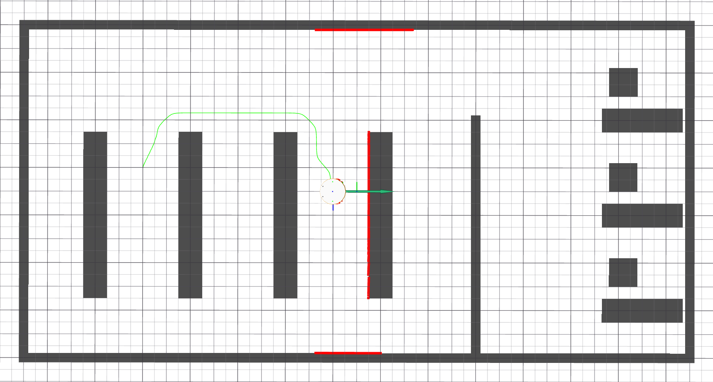

# Laboratorní úloha číslo 6 - Plánování tras
Cílem tohoto cvičení je implementovat algoritmus pro plánování trasy mezi dvěma souřadnicemi, a to konkrétně pomocí algoritmu A* (A-star). Studenti se naučí pracovat s mapou jako s grafem a vyhledávat v něm optimální řešení. Součástí cvičení je realizace služby (service), která bude dostupná klientům v jiných nodech, a která bude řešit problematiku plánování. Základní plán trasy bude následně rozšířen tak, aby byl dodržen bezpečný odstup od překážek, a aby byla trasa vyhlazena.
V rámci domácí přípravy studenti pochopí obecnou strukturu deterministických plánovacích algoritmů a budou vědět, které programové nástroje využijí k implementaci.

## Cíl cvičení 
Výledkem cvičení je:
  1) Služba `/plan_path`, která bude vracet naplánovanou trasu.
  2) Publikování naplánované trasy na topicu `/planned_path`.
  3) Vizualizace a ověření dat v Rvizu.

### Ukázka možného řešení

## Domácí příprava

> [!WARNING]  
> Zadání je spíše časově náročné, minimální nutná podmína je teoretické pochopení algoritmu a základní znalost práce se systémem ROS. Doporučuji ale si řešení částečně připravit doma. 

> [!CAUTION]
> Na konci cvičení bude práce ohodnocena až **5 body**!

### Pochopení plánovacích algoritmů
Cílem je na základě mapy prostředí a dvou pozic najít optimální trasu. Nastudujte si princip plánovacích algoritmů, s důrazem na algoritmus A*.

- Jak je reprezentovaná mapa a kde ji v rámci simulátoru můžeme získat?
- Jak převést souřadnice ze světového souřadnicového systému do systému mapy a zpět?
- Co znamenají pojmy "cost funkce" a "heuristická funkce"?
- Jaký význam má prioritní fronta a dle jakého kritéria ji budete řadit?
- Jaké informace o jednotlivých buňkách mapy je nutné během plánování uchovávat?

### Práce s ROS 2
Základy práce s ROS 2 jste se naučili v rámci minulého cvičení. V tomto týdnu přidáme práci s ROS services (služby), jedná se o request-based způsob komunikace v ROSu. 
- Jak zaslat a obsloužit požadavek na službu v ROS 2 za použití rclcpp::Node?
- Seznamte se se strukturou použitých zpráv a služeb z `nav_msgs`.

### Bezpečný odstup od překážek
Algoritmus A* ve své základní podobě vyhledává nejkratší trasu, která často vede podél hrany překážek, a pokud bychom navigovali střed robotu o nenulových rozměrech podél takové trasy, došlo by jistě ke kolizi. Obecně je lepší udržovat spíše větší odstup od překážek z důvodu nejistoty lokalizace robotu.

Jeden z možných přístupů je tzv. morfologická dilatace překážek (jak dilatace funguje si můžete přečíst na této [stránce](https://homepages.inf.ed.ac.uk/rbf/HIPR2/dilate.htm)). V podstatě by mělo dojít k "nafouknutí" překážek. Tento přístup není vhodný např. ve scénářích s úzkými koridory, ale pro účely našeho světa v simulátoru je to řešení dostačující.

### Vyhlazení trasy
Trasy vygenerované algoritmem A* jsou z principu zarovnané s mřížkou mapy, ve které plánování probíhá. To není vždy optimální, zejména s ohledem na kinematiku a dynamiku robotu s diferenciálním podvzokem. Vyplatí se proto trasu upravit tak, aby obsahovala minimum "ostrých zatáček", tj. posunout jednotlivé waypointy trasy tak, aby výsledek byl maximálně plynulý (matematicky vyjádřeno, pokud by trasa byla popsána spojitou funkcí, pak i její první deriace by měla být spojitá). 

Existuje více metod vedoucích k podobnému cíli, jako jednu variantu můžu doporučit iterativní gradientní algoritmus, který si můžet nastudovat na tomto [odkazu](https://medium.com/@jaems33/understanding-robot-motion-path-smoothing-5970c8363bc4).

## Hodnocení cvičení
> [!WARNING]  
> Cvičení nebude hodnoceno jen na základě funkčnosti. Bude hodnocen i zdrojový kód a pochopení problematiky. Doporučuji se připravit na otázky z domácí přípravy. 

V projektu mpc\_rbt\_student budete upravovat soubor `Planning.cpp` a příslušný hlavičkový soubor. Pro kompilaci programu budete upravovat `CMakeLists.txt` a `package.xml`. A pro spuštění nodu budete upravovat launch file `solution.launch.py`. 

### Doporučený postup
1) Přidejte připravený prázdný node Planning do `CMakeLists.txt`, zkompilujte jej a následně spusťe, např. pomocí launch filu.
2) Vytvořte klient pro načtení mapy prostředí a ověřte jeho funkčnost.
3) Implementujte obsluhu služby `plan_path` a vyzkoušejte její volání z CLI.
4) Implementujte funkci `aStar()` pro naplánování trasy mezi body zaslanými v requestu služby. (Tip: parametr `tolerance` nemusíte nijak využít.) Výsledek publikujte do topicu `planned_path`.
5) Upravte nastavení RVizu tak, aby zobrazoval trasu (display type Path). Konfiguraci uložte.
6) Ověřte funkčnost vašeho plánovacího algoritmu pro různé kombinace startovní a cílové pozice.
7) Implementujte funkci `dilateMap()`, která upraví podobu mapy použité pro plánování trasy. Zvolte vhodnou velikost odstupu od překážek. Zavolejte funkci ve vhodném místě v kódu.
8) Implementujte funkci `smoothPath()`, která upraví trasu vygenerovanou algoritmem A* tak, aby byla hladká. Zvolte vhodné parametry použitého algoritmu.
9) Ověřte funkčnost řešení jako celku.