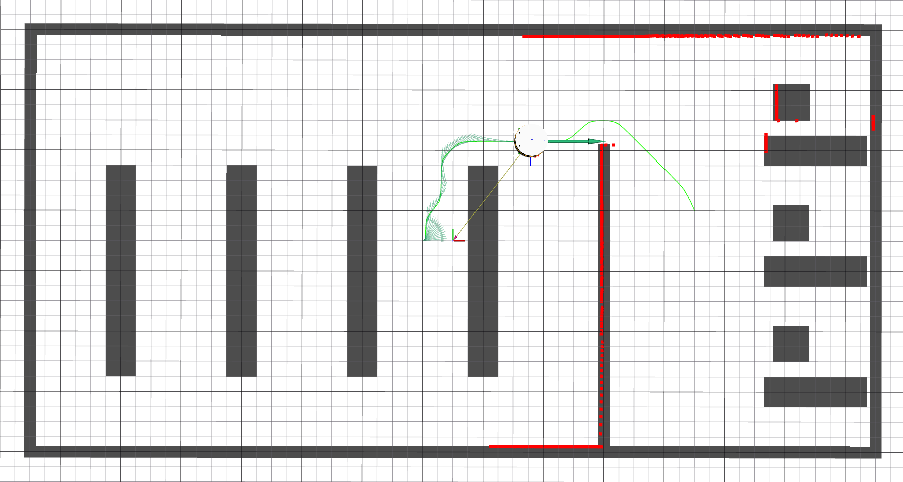

# Laboratorní úloha číslo 7 - Řízení pohybu
Cílem tohoto cvičení je implementovat algoritmus pro řízení pohybu, resp. sledování naplánované trasy. Studenti propojí komponenty realizované v předchozích cvičeních a doplní je o zvolený řídicí algoritmus. Součástí cvičení je realizace akce (action), která bude dostupná klientům v jiných nodech, a která bude řešit problematiku navigace. Základní navigační algoritmus bude rozšířen o nouzové zastavení v případě, že senzory detekují možnou kolizi s překážkou. 
V rámci domácí přípravy se studenti seznámí s vybranými řídicími algoritmy, které mohou využít ke splnění zadání.

## Cíl cvičení 
Výledkem cvičení je:
  1) Akce `/go_to_goal`, která bude přijímat cílovou pozici robotu.
  2) Nouzové zastavení - přerušení akce - pokud se robot vlivem chybné lokalizace dostane do blížící se kolize s překážkou.
  3) Vizualizace a ověření funkčnosti v Rvizu.

### Ukázka možného řešení

## Domácí příprava

> [!WARNING]  
> Zadání je spíše časově náročné, minimální nutná podmína je teoretické pochopení algoritmu a základní znalost práce se systémem ROS. Doporučuji ale si řešení částečně připravit doma. 

> [!CAUTION]
> Na konci cvičení bude práce ohodnocena až **5 body**!

### Pochopení algoritmů pro sledování trasy
Cílem je na základě znalosti aktuální pozice robotu a popisu trasy pomocí waypointů vypočítat požadovanou dopřednou a úhlovou rychlost robotu.

Metody můžeme rozdělit do dvou rodin:
- založené na XTE (cross-track error) = kolmá vzdálenost od trasy,
- založené na cílovém bodu = okamžitý cíl, na který se chceme navigovat, zpravidla jeden z waypointů.

V případě XTE metod je možné hodnotu XTE (orientovanou, je rozdíl, zda jsme vůči trase vpravo nebo vlebo) použít jako zpětnou vazbu a následně použít libovolnou strukturu regulátoru (např. PSD) pro řízení úhlové rychlosti.

U metod založených na cílovém bodu je klíčový způsob volby tohoto bodu. Může se jednat např. o bod v definované vzdálenosti nebo bod o *n* prvků posunutý vůči bodu nejbližšímu. Nevhodná volba cílového bodu zpravidla způsobí nepřesné sledování trasy nebo oscilace systému. Jedním ze zástupců těchto metod je tzv. [pure pursuit](https://www.ri.cmu.edu/pub_files/pub3/coulter_r_craig_1992_1/coulter_r_craig_1992_1.pdf) algoritmus. Zde je vhodné poznamenat, že algoritmus vyžaduje vyjádření pozice cílového bodu v souřadnicovém systému robotu, k tomu využijete [matici rotace](https://www.cuemath.com/algebra/rotation-matrix/).

Mějte na paměti, že jak úhlová, tak dopředná rychlost jsou limitovány, jejich omezení plyna z maximální rychlosti rotace obou kol. Ačkoli řídicí algoritmus spočítá libovolnou hodnotu těchto rychlostí, je nutné na výstup přidat saturaci a zvážit, že ne všechny kombinace dopředné a úhlové rychlosti jsou možné (např. nejvyšší úhlová rychlost je dosažitelná při nulové dopředné rychlost).

Jako parametr můžete potřeboval vzdálenost kol podvozku, tuto hodnotu poskytuje simulátor v namespace `robot_config`.

### Práce s ROS 2
Základy práce s ROS 2 jste se naučili v rámci minulých cvičení. V tomto týdnu přidáme práci s ROS actions (akce), jedná se o asynchronní způsob komunikace v ROSu vhodný pro déle trvající úkoly, během jejichž vykonávání odesílá server klientovi průběžně zpětnou vazbu.
- Jak zaslat a obsloužit požadavek na akci v ROS 2 za použití rclcpp::Node?
- Seznamte se se strukturou použité akce z balíku `nav2_msgs`.

Obsluha akce zpravidla běží v samostatném vlákně, aby neblokovala ostatní operace prováděné nodem. V rámci cvičení budete muset vytvořit také klienta pro plánovací službu implementovanou v předchozím cvičení. Pro ovládání robotu budete publikovat požadované rychlosti na topicu `/cmd_vel`.

### Nouzové zastavení
Lokalizace založená na odometrii je výpočetně nenáročná a krátkodobě využitelná, nicméně všechny chyby se postupně integrují a přesnost lokalizačního řešení v čase klesá, nejsou-li k dispozici jiná data, kterými by bylo možné řešení korigovat. 

Abychom zabránili kolizi robotu s překážkou v případě, že lokalizace selže, je vhodné implementovat nějakou formu ochrany. Robot má k dispozici data z lidaru. Prozkoumejte strukturu zprávy `sensor_msgs/msg/LaserScan` a zjistěte, která data jsou relevantní z hlediska detekce překážky ležící ve směru jízdy robotu. Navrhněte vhodnou prahovou hodnotu, při jejímž překročení má být nouzové zastavení aktivováno. Nezapomeňte v takové situaci na obsluhu klienta, který požádal o navigaci do cíle.

## Hodnocení cvičení
> [!WARNING]  
> Cvičení nebude hodnoceno jen na základě funkčnosti. Bude hodnocen i zdrojový kód a pochopení problematiky. Doporučuji se připravit na témata z domácí přípravy. 

V projektu mpc\_rbt\_student budete upravovat soubor `MotionControl.cpp` a příslušný hlavičkový soubor. Pro kompilaci programu budete upravovat `CMakeLists.txt` a `package.xml`. A pro spuštění nodu budete upravovat launch file `solution.launch.py`. 

### Doporučený postup
1) Přidejte připravený prázdný node MotionControl do `CMakeLists.txt`, zkompilujte jej a následně spusťe, např. pomocí launch filu.
2) Vytvořte klient pro vyžádání plánu trasy a ověřte jeho funkčnost.
3) Implementujte obsluhu akce `go_to_goal` a vyzkoušejte její spuštění z CLI. Hlavní smyčka akce bude umístěna ve funkci `execute()`.
4) Implementujte funkci `updateTwist()`, kterou zavoláte v okamžiku, kdy dostanete čerstvá lokalizační data. Je-li navigační akce aktivní, měla by funkce vypočítat požadované rychlosti robotu a publikovat je na příslušném topicu.
5) Ověřte funkčnost vašeho navigačního algoritmu pro různé cílové pozice.
6) Implementujte funkci `checkCollision()`, která zajistí bezpečné zastavení robotu v případě hrozícíc kolize.
7) Ověřte funkčnost řešení jako celku.